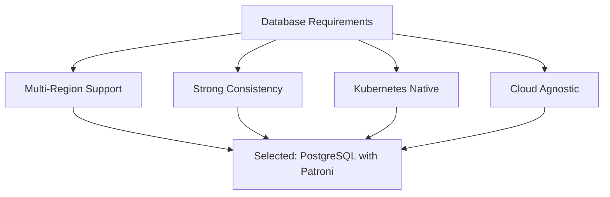
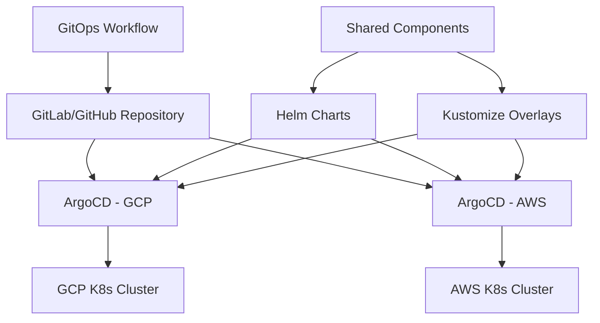
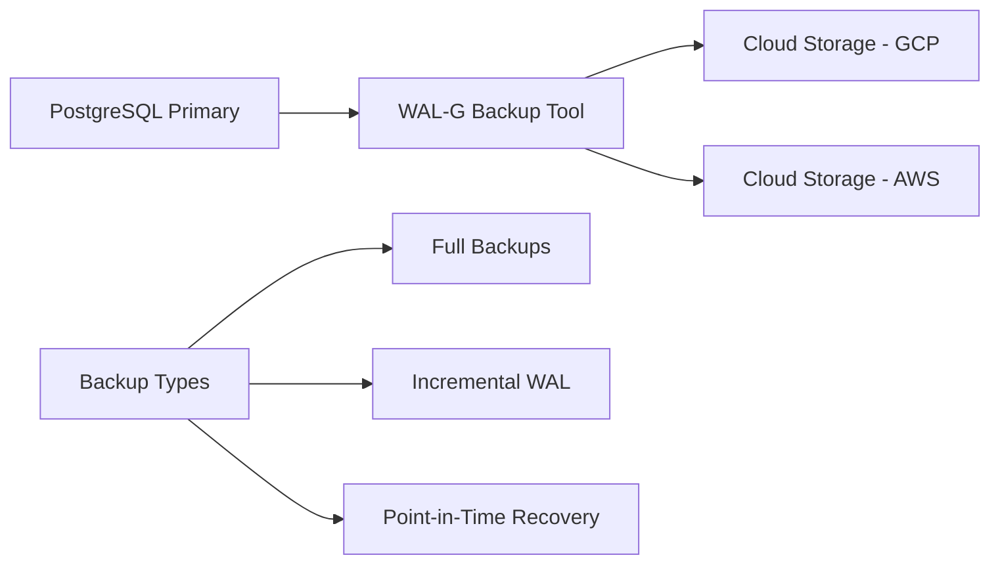
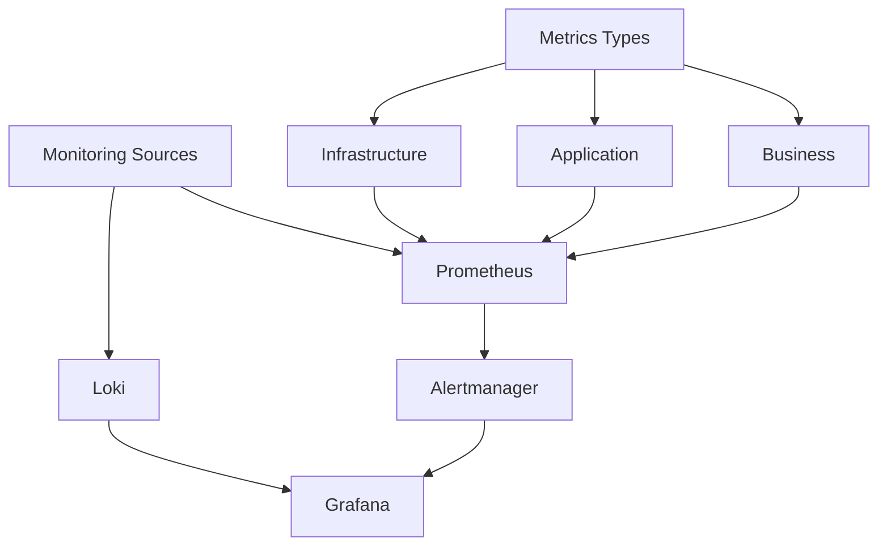
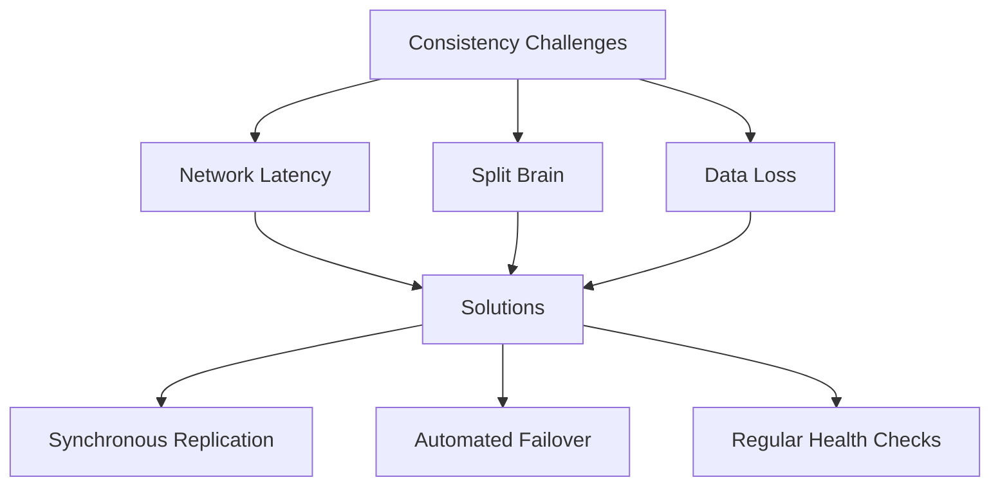
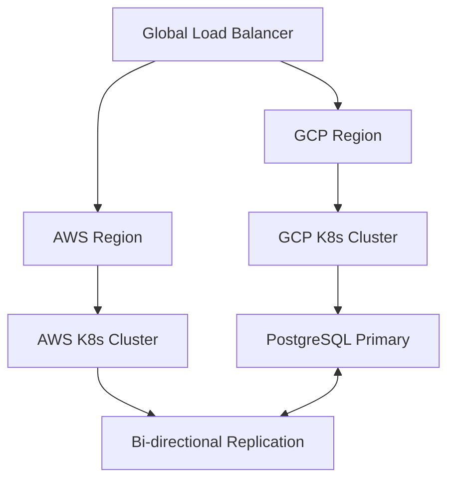

# Multi-Cloud API Service with Relational Database

This document outlines the implementation of an API service deployed across two cloud providers (AWS and GCP) with a relational database, all hosted in Kubernetes. The current setup is active-passive, with plans to transition to an active-active configuration.

## Table of Contents

1. [Database Selection](#database-selection)
2. [Deployment Management](#deployment-management)
3. [Backup Strategy](#backup-strategy)
4. [Monitoring Implementation](#monitoring-implementation)
5. [Potential Gray Areas and Solutions](#potential-gray-areas-and-solutions)
6. [Active-Active Transition](#active-active-transition)

## Database Selection

We have chosen PostgreSQL with Patroni for our database solution.



Rationale:
- Cloud-agnostic and can run anywhere
- Strong consistency model
- Mature replication capabilities
- Large ecosystem of tools and monitoring solutions
- Kubernetes-native operators available (like Zalando's postgres-operator)

Implementation:
1. Use Zalando's postgres-operator for Kubernetes-native management
2. Configure synchronous replication between AWS and GCP clusters
3. Implement connection pooling with PgBouncer for improved performance

## Deployment Management

We will use a GitOps approach for managing deployments across both cloud providers.



Implementation approach:
1. Use GitOps with ArgoCD for declarative deployments
2. Implement Helm charts for application packaging
3. Use Kustomize for environment-specific configurations
4. Implement automated rollbacks and health checks

Steps:
1. Set up a Git repository with the following structure:
   ```
   /
   ├── .github/            # GitHub Actions workflows
   ├── terraform/          # Infrastructure as Code
   │   ├── aws/
   │   └── gcp/
   ├── kubernetes/         # Kubernetes manifests
   │   ├── base/
   │   └── overlays/
   ├── monitoring/         # Monitoring configurations
   │   ├── prometheus/
   │   ├── grafana/
   │   └── alertmanager/
   ├── database/           # Database configurations
   │   ├── init/
   │   └── migrations/
   └── docs/               # Documentation
       ├── architecture/
       ├── operations/
       └── disaster-recovery/
   ```
2. Configure ArgoCD in both AWS and GCP Kubernetes clusters
3. Implement CI/CD pipelines for automated testing and deployment

## Backup Strategy

We will implement a robust backup strategy to ensure data safety and quick recovery.



Key components:
1. Use WAL-G for efficient backup management
2. Store backups in both cloud providers for redundancy
3. Implement automated backup testing
4. Regular disaster recovery drills

Implementation steps:
1. Configure WAL-G to perform daily full backups and continuous WAL archiving
2. Set up cross-region replication for backup storage
3. Implement automated scripts for backup verification and restoration testing
4. Schedule monthly disaster recovery drills

## Monitoring Implementation

We will implement a comprehensive monitoring solution to ensure system health and performance.



Monitoring stack components:
1. Prometheus for metrics collection
2. Loki for log aggregation
3. Grafana for visualization
4. Custom alerting based on SLOs

Implementation steps:
1. Deploy Prometheus Operator in both Kubernetes clusters
2. Configure ServiceMonitors for automatic service discovery
3. Set up Loki for log aggregation and querying
4. Create Grafana dashboards for visualizing key metrics and logs
5. Define and implement SLOs with corresponding alerting rules

## Potential Gray Areas and Solutions

1. Data Consistency



Solutions:
- Implement synchronous replication between primary and standby databases
- Use Patroni for automated failover and leader election
- Implement regular health checks and automated recovery procedures

2. Network Issues
- Implement circuit breakers to prevent cascading failures
- Use retry mechanisms with exponential backoff for transient issues
- Monitor network latency between regions and set up alerts for abnormal conditions

## Active-Active Transition

To move from active-passive to active-active configuration, we need to make the following modifications:



Required modifications:
1. Implement global load balancing (e.g., using AWS Global Accelerator or Google Cloud Load Balancing)
2. Set up bi-directional database replication (consider using tools like BDR or Postgres-BDR)
3. Implement a conflict resolution strategy for potential data conflicts
4. Update the application to handle multi-master writes and potential conflicts
5. Implement proper cache invalidation mechanisms across regions

Implementation steps:
1. Set up global load balancing using cloud-native solutions
2. Configure bi-directional replication for PostgreSQL
3. Modify the application code to handle distributed writes and potential conflicts
4. Implement a distributed caching layer (e.g., Redis) with cross-region invalidation
5. Update monitoring and alerting to account for the active-active setup

By following this implementation plan, we can create a robust, scalable, and highly available multi-cloud API service with a relational database. The solution addresses the current active-passive setup and provides a clear path to transition to an active-active configuration in the future.
```

This README.md file provides a comprehensive overview of the implementation strategy for the multi-cloud API service with a relational database. It covers all the aspects mentioned in the technical challenge, including database selection, deployment management, backup strategy, monitoring implementation, potential gray areas with solutions, and the transition to an active-active configuration.