# Multi-Cloud API Service with Relational Database

This document outlines the implementation of an API service deployed across two cloud providers (AWS and GCP) with a relational database, all hosted in Kubernetes. The current setup is active-passive, with plans to transition to an active-active configuration.

## Table of Contents

1. [Database Selection](#database-selection)
2. [Deployment Management](#deployment-management)
3. [Backup Strategy](#backup-strategy)
4. [Monitoring Implementation](#monitoring-implementation)
5. [Potential Gray Areas and Solutions](#potential-gray-areas-and-solutions)
6. [Active-Active Transition](#active-active-transition)

## Database Selection

We have chosen PostgreSQL with Patroni for our database solution.

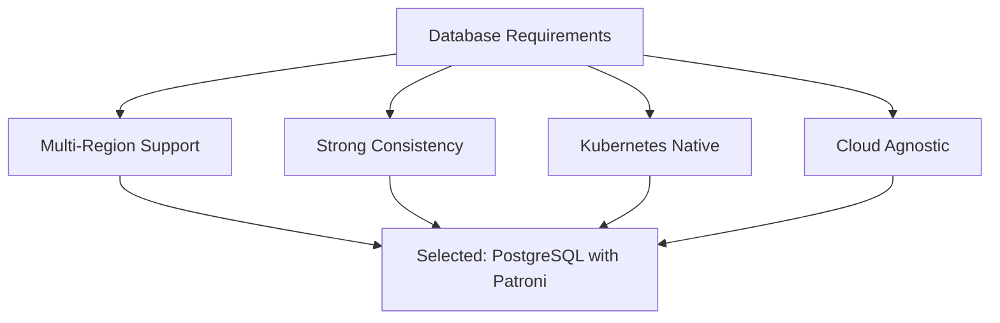

Rationale:
- Cloud-agnostic and can run anywhere
- Strong consistency model
- Mature replication capabilities
- Large ecosystem of tools and monitoring solutions
- Kubernetes-native operators available (like Zalando's postgres-operator)

Implementation:
1. Use Zalando's postgres-operator for Kubernetes-native management
2. Configure synchronous replication between AWS and GCP clusters
3. Implement connection pooling with PgBouncer for improved performance

## Deployment Management

We will use a GitOps approach for managing deployments across both cloud providers.

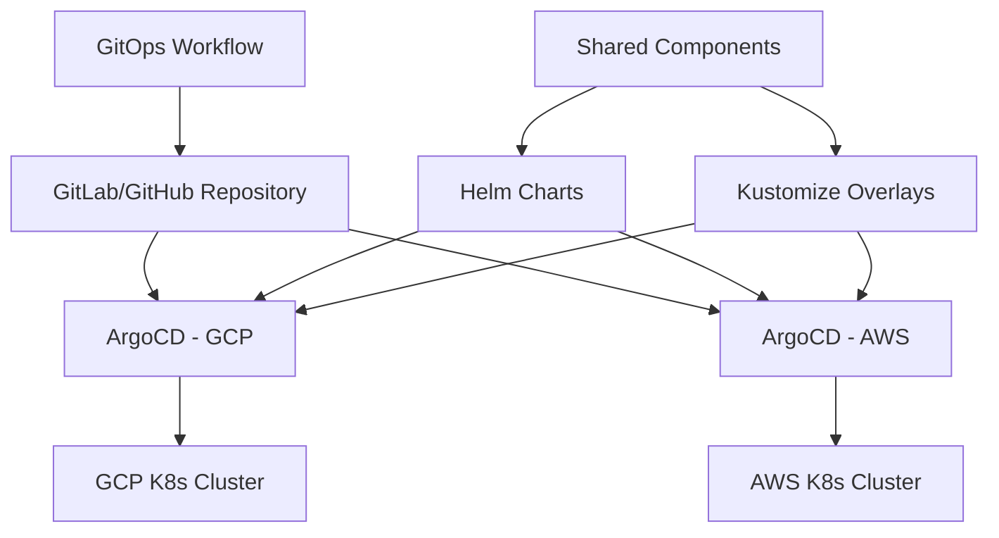

Implementation approach:
1. Use GitOps with ArgoCD for declarative deployments
2. Implement Helm charts for application packaging
3. Use Kustomize for environment-specific configurations
4. Implement automated rollbacks and health checks

Steps:
1. Set up a Git repository with the following structure:
   ```
   /
   ├── .github/            # GitHub Actions workflows
   ├── terraform/          # Infrastructure as Code
   │   ├── aws/
   │   └── gcp/
   ├── kubernetes/         # Kubernetes manifests
   │   ├── base/
   │   └── overlays/
   ├── monitoring/         # Monitoring configurations
   │   ├── prometheus/
   │   ├── grafana/
   │   └── alertmanager/
   ├── database/           # Database configurations
   │   ├── init/
   │   └── migrations/
   └── docs/               # Documentation
       ├── architecture/
       ├── operations/
       └── disaster-recovery/
   ```
2. Configure ArgoCD in both AWS and GCP Kubernetes clusters
3. Implement CI/CD pipelines for automated testing and deployment

## Backup Strategy

We will implement a robust backup strategy to ensure data safety and quick recovery.

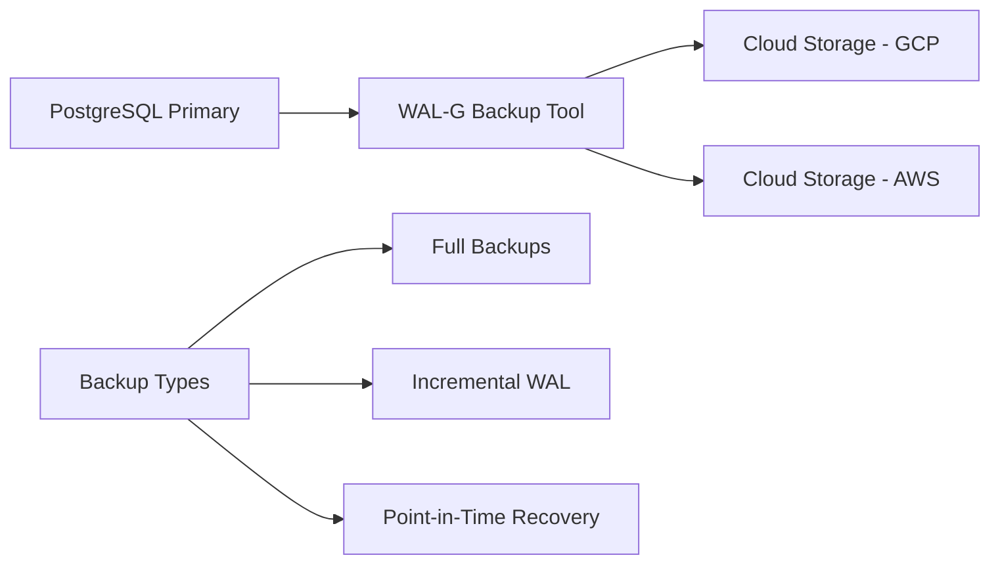

Key components:
1. Use WAL-G for efficient backup management
2. Store backups in both cloud providers for redundancy
3. Implement automated backup testing
4. Regular disaster recovery drills

Implementation steps:
1. Configure WAL-G to perform daily full backups and continuous WAL archiving
2. Set up cross-region replication for backup storage
3. Implement automated scripts for backup verification and restoration testing
4. Schedule monthly disaster recovery drills

## Monitoring Implementation

We will implement a comprehensive monitoring solution to ensure system health and performance.

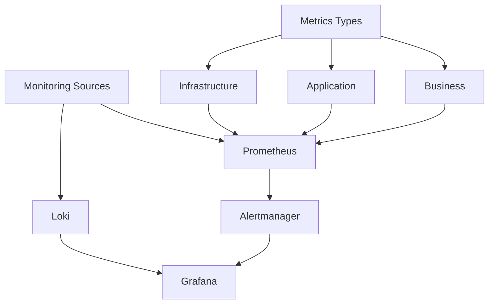

Monitoring stack components:
1. Prometheus for metrics collection
2. Loki for log aggregation
3. Grafana for visualization
4. Custom alerting based on SLOs

Implementation steps:
1. Deploy Prometheus Operator in both Kubernetes clusters
2. Configure ServiceMonitors for automatic service discovery
3. Set up Loki for log aggregation and querying
4. Create Grafana dashboards for visualizing key metrics and logs
5. Define and implement SLOs with corresponding alerting rules

## Potential Gray Areas and Solutions

1. Data Consistency

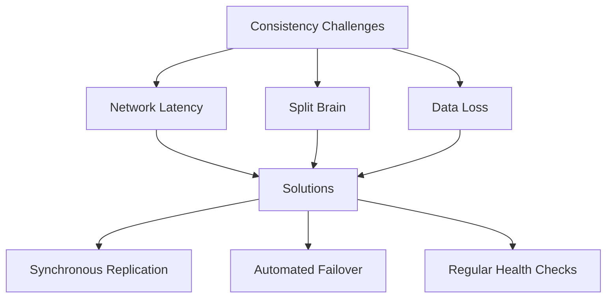

Solutions:
- Implement synchronous replication between primary and standby databases
- Use Patroni for automated failover and leader election
- Implement regular health checks and automated recovery procedures

2. Network Issues
- Implement circuit breakers to prevent cascading failures
- Use retry mechanisms with exponential backoff for transient issues
- Monitor network latency between regions and set up alerts for abnormal conditions

## Active-Active Transition

To move from active-passive to active-active configuration, we need to make the following modifications:

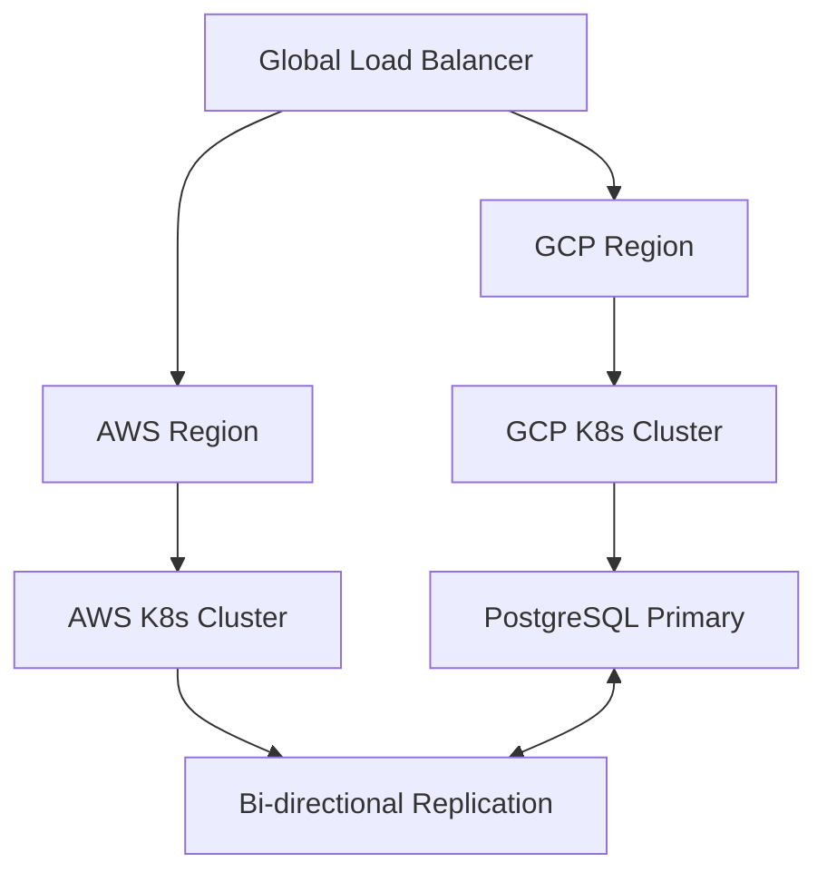

Required modifications:
1. Implement global load balancing (e.g., using AWS Global Accelerator or Google Cloud Load Balancing)
2. Set up bi-directional database replication (consider using tools like BDR or Postgres-BDR)
3. Implement a conflict resolution strategy for potential data conflicts
4. Update the application to handle multi-master writes and potential conflicts
5. Implement proper cache invalidation mechanisms across regions

Implementation steps:
1. Set up global load balancing using cloud-native solutions
2. Configure bi-directional replication for PostgreSQL
3. Modify the application code to handle distributed writes and potential conflicts
4. Implement a distributed caching layer (e.g., Redis) with cross-region invalidation
5. Update monitoring and alerting to account for the active-active setup

By following this implementation plan, we can create a robust, scalable, and highly available multi-cloud API service with a relational database. The solution addresses the current active-passive setup and provides a clear path to transition to an active-active configuration in the future.
```

This README.md file provides a comprehensive overview of the implementation strategy for the multi-cloud API service with a relational database. It covers all the aspects mentioned in the technical challenge, including database selection, deployment management, backup strategy, monitoring implementation, potential gray areas with solutions, and the transition to an active-active configuration.

```

---

#
#
#
#
#
    

# SPANISH VERSION


# Servicio API Multi-Cloud con Base de Datos Relacional

Este documento describe la implementación de un servicio API desplegado en dos proveedores de nube (AWS y GCP) con una base de datos relacional, todo alojado en Kubernetes. La configuración actual es activo-pasivo, con planes para transicionar a una configuración activo-activo.

## Tabla de Contenidos

1. [Selección de Base de Datos](#selección-de-base-de-datos)
2. [Gestión de Despliegues](#gestión-de-despliegues)
3. [Estrategia de Copias de Seguridad](#estrategia-de-copias-de-seguridad)
4. [Implementación de Monitoreo](#implementación-de-monitoreo)
5. [Áreas Grises Potenciales y Soluciones](#áreas-grises-potenciales-y-soluciones)
6. [Transición a Activo-Activo](#transición-a-activo-activo)

## Selección de Base de Datos

Hemos elegido PostgreSQL con Patroni como nuestra solución de base de datos.

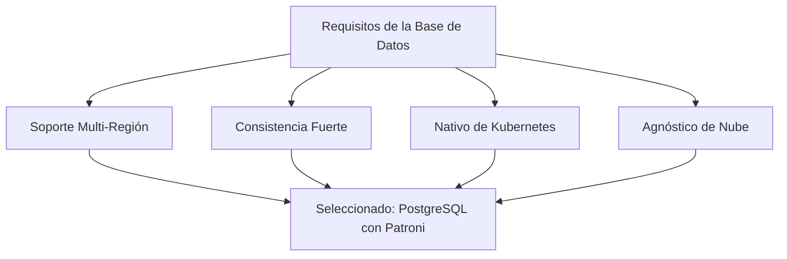

Justificación:
- Agnóstico de nube y puede ejecutarse en cualquier lugar
- Modelo de consistencia fuerte
- Capacidades maduras de replicación
- Gran ecosistema de herramientas y soluciones de monitoreo
- Operadores nativos de Kubernetes disponibles (como postgres-operator de Zalando)

Implementación:
1. Usar postgres-operator de Zalando para la gestión nativa en Kubernetes
2. Configurar replicación síncrona entre los clústeres de AWS y GCP
3. Implementar agrupación de conexiones con PgBouncer para mejorar el rendimiento

## Gestión de Despliegues

Utilizaremos un enfoque GitOps para gestionar los despliegues en ambos proveedores de nube.

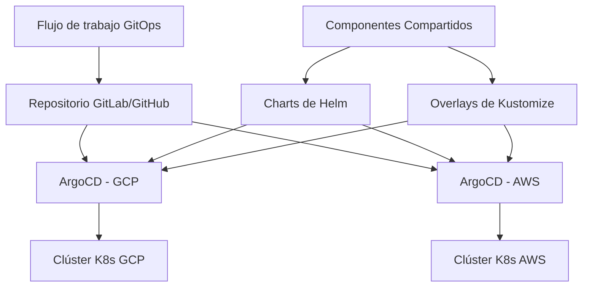

Enfoque de implementación:
1. Usar GitOps con ArgoCD para despliegues declarativos
2. Implementar charts de Helm para el empaquetado de aplicaciones
3. Usar Kustomize para configuraciones específicas del entorno
4. Implementar rollbacks automatizados y comprobaciones de salud

Pasos:
1. Configurar un repositorio Git con la siguiente estructura:
   ```
   /
   ├── .github/            # Flujos de trabajo de GitHub Actions
   ├── terraform/          # Infraestructura como Código
   │   ├── aws/
   │   └── gcp/
   ├── kubernetes/         # Manifiestos de Kubernetes
   │   ├── base/
   │   └── overlays/
   ├── monitoring/         # Configuraciones de monitoreo
   │   ├── prometheus/
   │   ├── grafana/
   │   └── alertmanager/
   ├── database/           # Configuraciones de base de datos
   │   ├── init/
   │   └── migrations/
   └── docs/               # Documentación
       ├── architecture/
       ├── operations/
       └── disaster-recovery/
   ```
2. Configurar ArgoCD en los clústeres de Kubernetes de AWS y GCP
3. Implementar pipelines de CI/CD para pruebas y despliegue automatizados

## Estrategia de Copias de Seguridad

Implementaremos una estrategia robusta de copias de seguridad para garantizar la seguridad de los datos y una recuperación rápida.

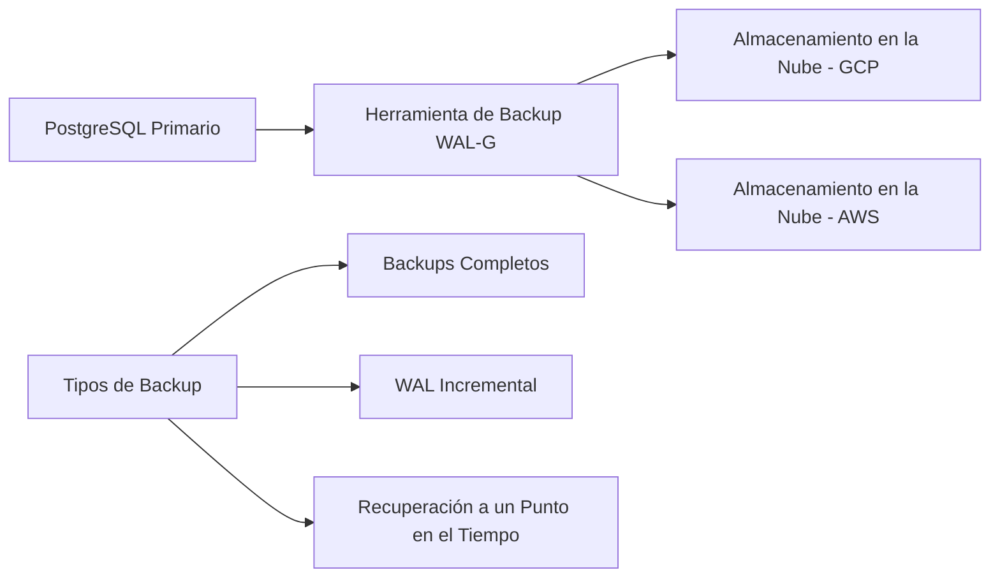

Componentes clave:
1. Usar WAL-G para una gestión eficiente de copias de seguridad
2. Almacenar copias de seguridad en ambos proveedores de nube para redundancia
3. Implementar pruebas automatizadas de copias de seguridad
4. Realizar simulacros regulares de recuperación ante desastres

Pasos de implementación:
1. Configurar WAL-G para realizar copias de seguridad completas diarias y archivado continuo de WAL
2. Configurar replicación entre regiones para el almacenamiento de copias de seguridad
3. Implementar scripts automatizados para verificación de copias de seguridad y pruebas de restauración
4. Programar simulacros mensuales de recuperación ante desastres

## Implementación de Monitoreo

Implementaremos una solución integral de monitoreo para garantizar la salud y el rendimiento del sistema.

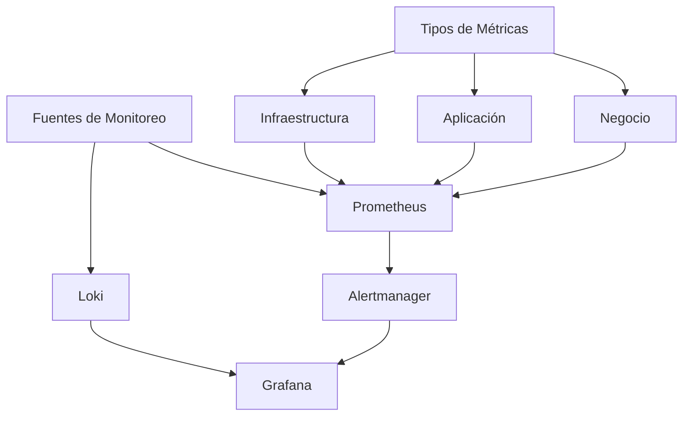

Componentes del stack de monitoreo:
1. Prometheus para la recolección de métricas
2. Loki para la agregación de logs
3. Grafana para la visualización
4. Alertas personalizadas basadas en SLOs

Pasos de implementación:
1. Desplegar Prometheus Operator en ambos clústeres de Kubernetes
2. Configurar ServiceMonitors para el descubrimiento automático de servicios
3. Configurar Loki para la agregación y consulta de logs
4. Crear dashboards en Grafana para visualizar métricas y logs clave
5. Definir e implementar SLOs con reglas de alerta correspondientes

## Áreas Grises Potenciales y Soluciones

1. Consistencia de Datos

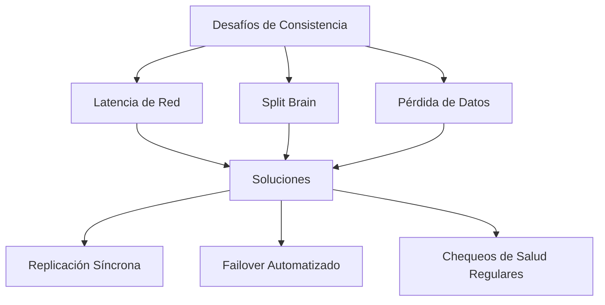

Soluciones:
- Implementar replicación síncrona entre las bases de datos primaria y de respaldo
- Usar Patroni para failover automatizado y elección de líder
- Implementar chequeos de salud regulares y procedimientos de recuperación automatizados

2. Problemas de Red
- Implementar circuit breakers para prevenir fallos en cascada
- Usar mecanismos de reintento con retroceso exponencial para problemas transitorios
- Monitorear la latencia de red entre regiones y configurar alertas para condiciones anormales

## Transición a Activo-Activo

Para pasar de una configuración activo-pasivo a activo-activo, necesitamos hacer las siguientes modificaciones:

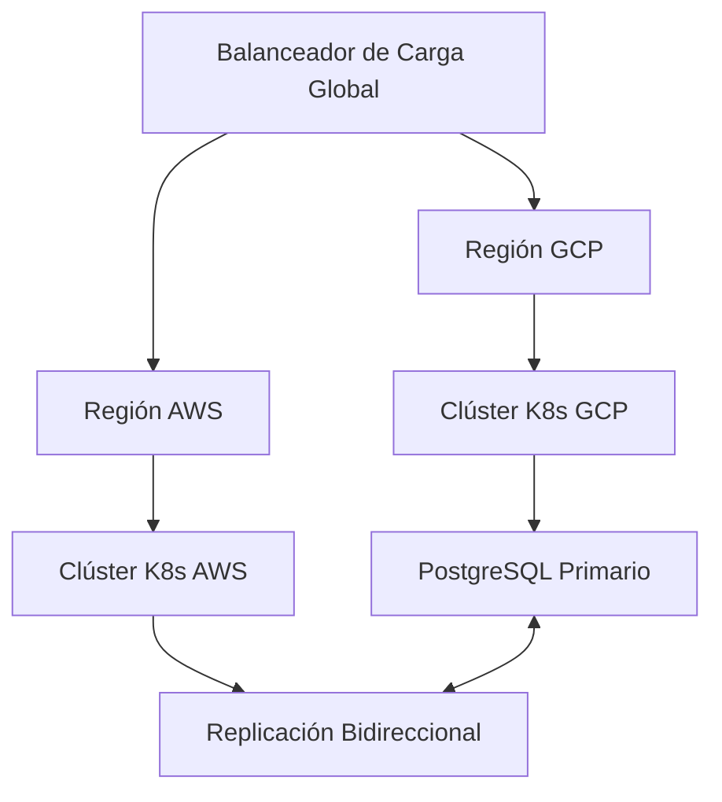

Modificaciones requeridas:
1. Implementar balanceo de carga global (por ejemplo, usando AWS Global Accelerator o Google Cloud Load Balancing)
2. Configurar replicación bidireccional de la base de datos (considerar el uso de herramientas como BDR o Postgres-BDR)
3. Implementar una estrategia de resolución de conflictos para posibles conflictos de datos
4. Actualizar la aplicación para manejar escrituras multi-master y posibles conflictos
5. Implementar mecanismos adecuados de invalidación de caché entre regiones

Pasos de implementación:
1. Configurar balanceo de carga global usando soluciones nativas de la nube
2. Configurar replicación bidireccional para PostgreSQL
3. Modificar el código de la aplicación para manejar escrituras distribuidas y posibles conflictos
4. Implementar una capa de caché distribuida (por ejemplo, Redis) con invalidación entre regiones
5. Actualizar el monitoreo y las alertas para tener en cuenta la configuración activo-activo

Siguiendo este plan de implementación, podemos crear un servicio API multi-cloud robusto, escalable y altamente disponible con una base de datos relacional. La solución aborda la configuración activo-pasivo actual y proporciona un camino claro para la transición a una configuración activo-activo en el futuro.
